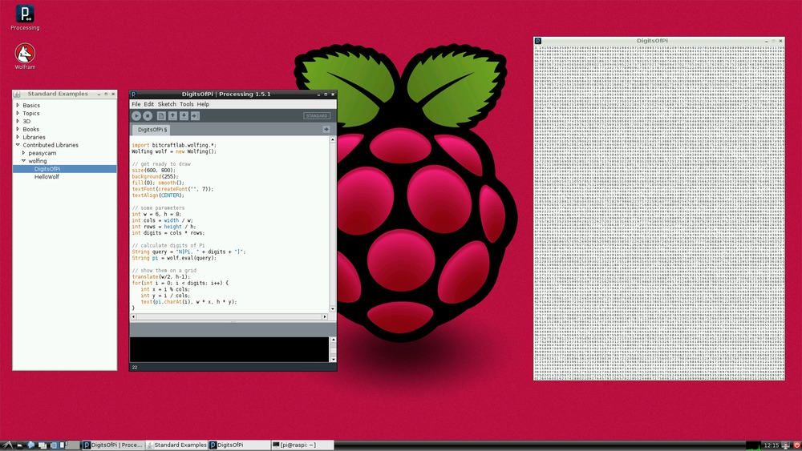

Wolfing: WolframLang for Processing
===================================

Harness the power of Mathematica and Wolfram Alpha in your Processing Sketches!

This is the branch of the library that is targetted at **OSX with Mathematica Home Edition**.

### Examples

- Calculate the result of 1 + 1
- Show as many digits of Pi as your screen can cope with
- More to come :-)

### License

This software is released under an LGPL License.
It's a Wrapper for JLink, provided by Wolfram under their own License.
Wolfing is not associated in any way with Wolfram Research or Mathematica.

### Getting started 

These instructions refer to OSX with Mathematica Home Edition and Processing 1.5.1.

### Install Wolfing

1. Clone this repo to your sketchbook folder

		cd Documents/Processing/sketchbook
		clone https://github.com/bitcraftlab/wolfing.git
		
2.	Make sure to checkout the OSX branch

		cd wolfing
		git checkout osx

2. Add JLink files:

		make link

### Export Applications from Processing

When you export a sketch as application, Processing will automatically copy all libraries to the sketch.  
The application should now work out of the box on any Mac that has Mathematica Home Edition installed.
Use at your own risk and make sure to read the [JLink license](file:///Applications/Mathematica%20Home%20Edition.app/SystemFiles/Links/JLink/License.txt) if you plan to distribute your Application.
