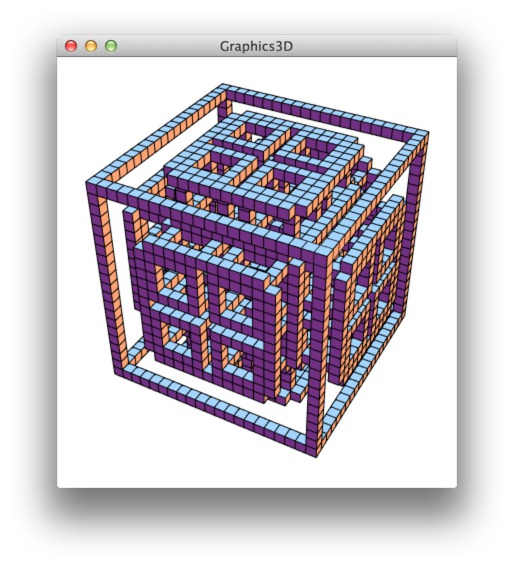

Wolfing: WolframLang for Processing
===================================

Harness the power of Mathematica and Wolfram Alpha in your Processing Sketches!

This branch of the library is targetted at **OSX + Mathematica 10 (64bit)**.  
There is also a branch for OSX with Mathematica Home Edition...

### Examples

- Calculate the result of 1 + 1
- Show as many digits of Pi as your screen can cope with
- More to come :-)

### License

This software is released under an LGPL License.
It's a Wrapper for JLink, provided by Wolfram under their own License.
Wolfing is not associated in any way with Wolfram Research or Mathematica.

### Getting started 

- [Install on OSX](INSTALL-OSX.md)
- [Install on Raspberry Pi](INSTALL-PI.md)

### Examples + Screenshots

[][examples]

A list of all the examples can be found [here][examples].

### Export Applications from Processing

When you export a sketch as application, Processing will automatically copy all libraries to the sketch.  
The application should now work out of the box on any Mac that has Mathematica installed.
Use at your own risk and make sure to read the [JLink license](file:///Applications/Mathematica%20Home%20Edition.app/SystemFiles/Links/JLink/License.txt) if you plan to distribute your Application.

[examples]: examples
