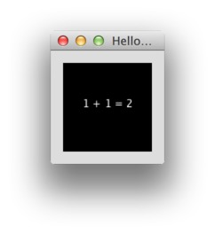
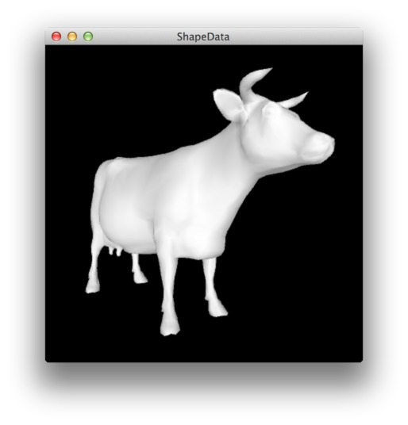
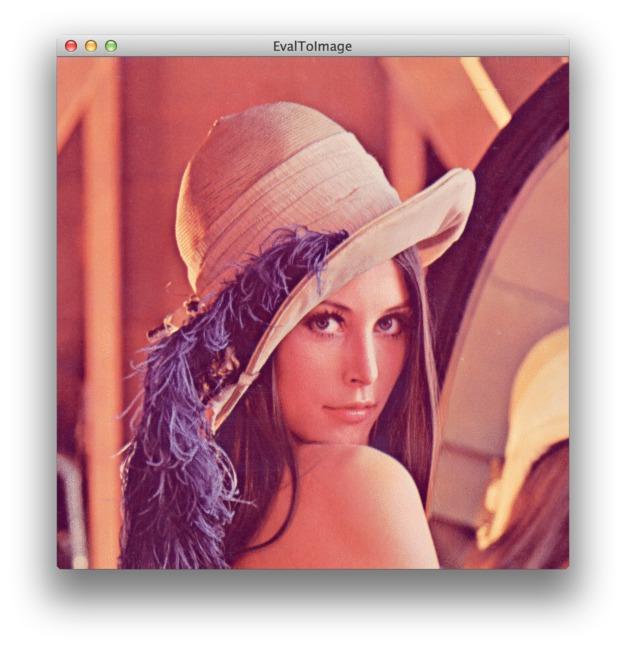
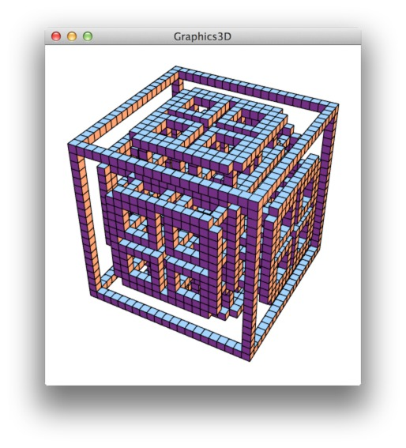
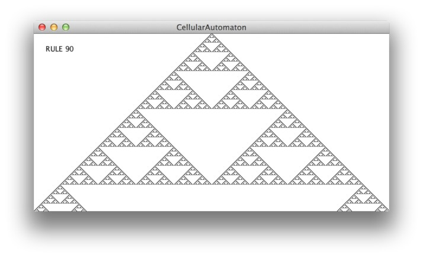

Examples
========

### Hello Wolf ###

This example shows how to evaluate expressions and display the result in Processing.

### Digits of Pi ###

This example shows how to construct expressions dynamically.  
The expression `N[Pi,  n]` returns the first `n` digits of **π**.

### EvalToShape ###

Example of how to generate `.OBJ` meshes in WolframLang   
and import the result directly into Processing PShape files.  
This example uses the `PeasyCam` library.

### EvalToImage ###

Example of how to get the result of an expression as an image.  
The expression `ExampleData[{"TestImage", "Lena"}]` loads a testimage.  
Note that images retrieved via `wolf.evalToImage(...)` are encoded as GIFs.  
As a result the color palette is currently limited to 256 colors.

 
 
### Graphics3D ###
 
Another Example of *evalToImage*.  
Using the powerfull `CellularAutomaton`, and `Graphics3D` functions of Mathematica. 

The Mathematica code looks like this:

    Graphics3D[
    	Cuboid /@ Position[
        	CellularAutomaton[
        		{14, {2, 1}, {1, 1, 1}}, 
    			{{{{1}}}, 0}, 
    			{{{10}}}
    		], 1	
    	]
    , Boxed -> False]
 
 
### Cellular Automaton ###
 
Example for *evalToImage* with predefined Image size.  
Note the use of the `PixelConstrained` attribute to get pixel perfect rendering.
 

