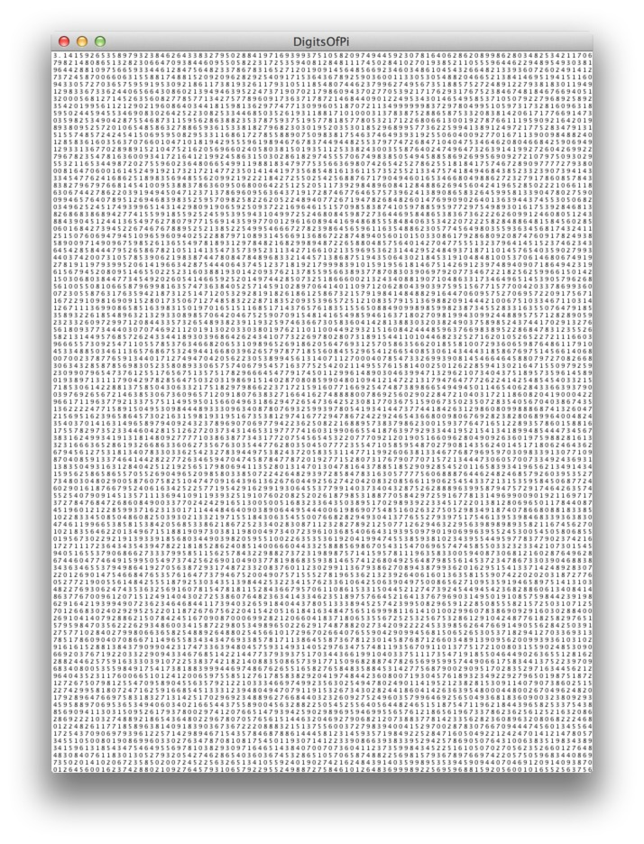
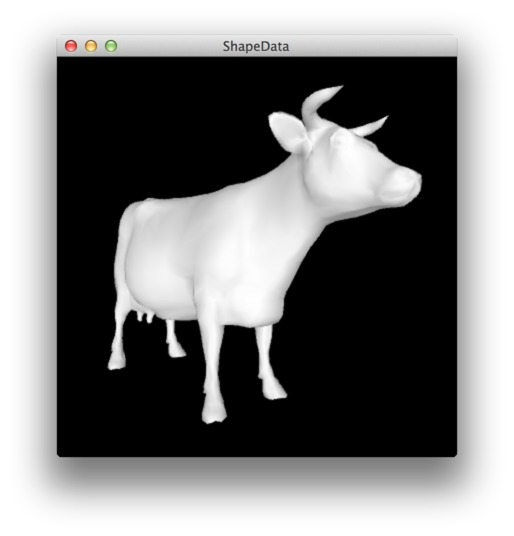

Examples
========

### Hello Wolf ###

This example shows how to evaluate expressions and display the result in Processing.

### Digits of Pi ###

This example shows how to construct expressions dynamically.  
The expression `N[Pi,  n]` returns the first `n` digits of **π**.

### ShapeData ###

Example of how to generate `.OBJ` meshes in WolframLang,    
and import the result directly into Processing PShape files.  
This example requires the `PeasyCam` library.

